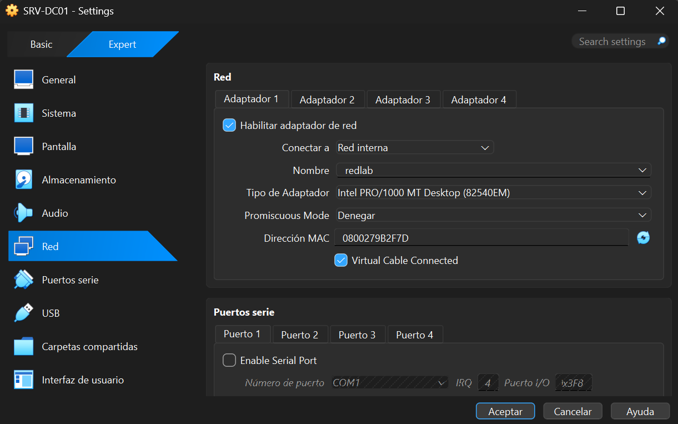
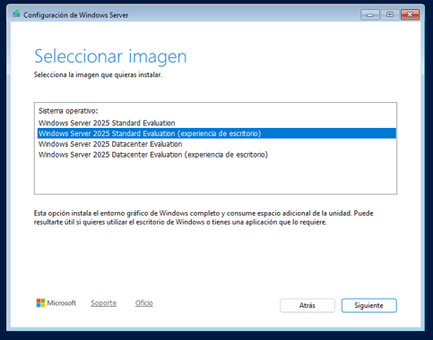
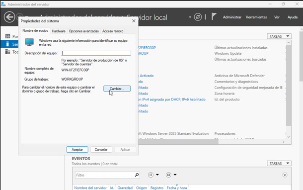
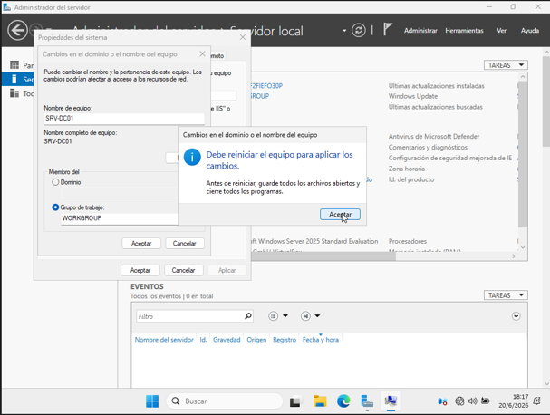
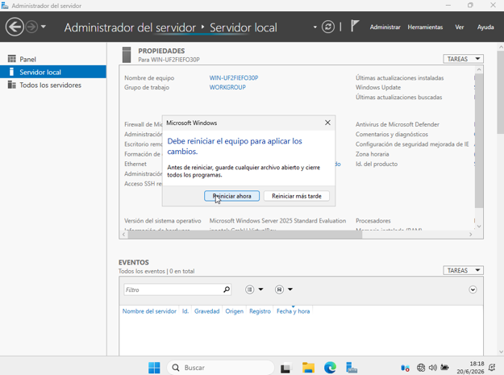
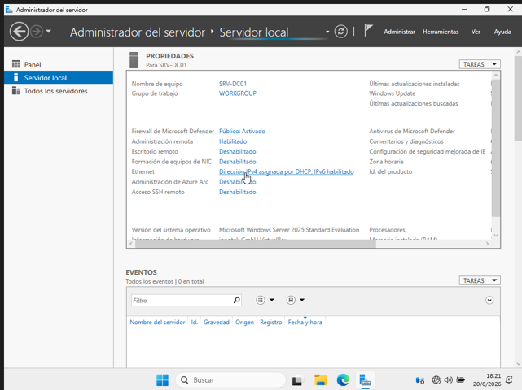
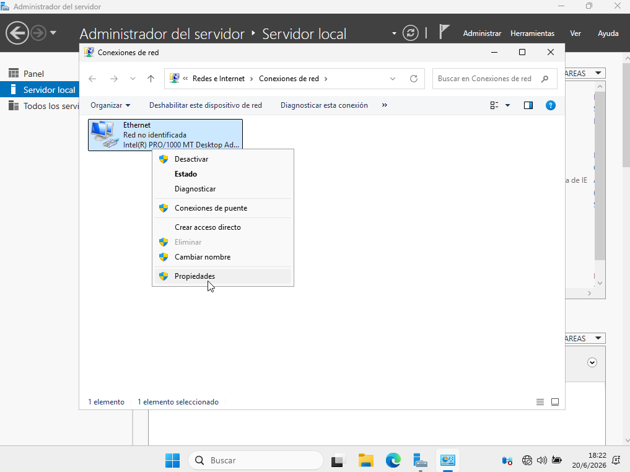
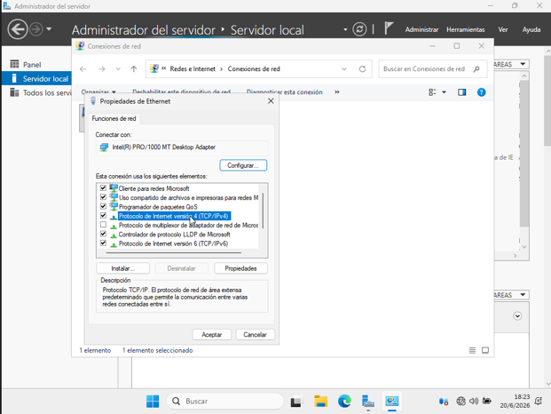
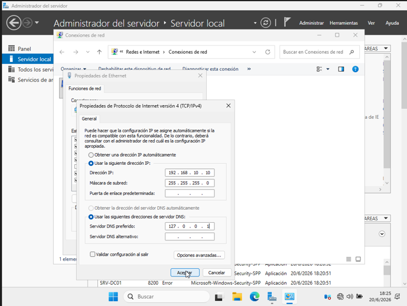
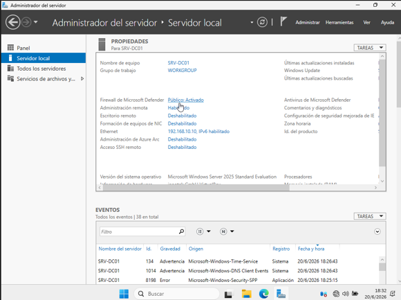

# 2.1.1 Instalación y Configuración Básica

**¿Qué haremos aquí de forma sencilla?**
Vamos a "comprar" y encender el computador del Jefe (el Servidor). Le instalaremos su sistema operativo (Windows Server) y le pondremos una placa con su nombre en la puerta de su oficina. Además, le daremos un número de teléfono fijo (Dirección IP) para que los empleados nunca se pierdan al intentar llamarlo.

---

## 🧩 Guía paso a paso: Crear y configurar el servidor SRV-DC01

### 🟦 1. Crear la máquina virtual
Abre VirtualBox y haz clic en el botón **Nueva**. Configura los siguientes datos:
* **Nombre:** `SRV-DC01`
* **Tipo:** Microsoft Windows
* **Versión:** Windows Server 2022 (64-bit) o Windows Server 2025 (64-bit)
* **ISO:** *Déjala sin seleccionar por ahora.*

**Recursos del sistema:**
* **Memoria (RAM):** Entre 2048 MB (2 GB) y 4096 MB (4 GB). *(Si tu PC real tiene 16GB o más, usa 4 GB para que la instalación sea mucho más rápida).*
* **Procesador (CPU):** 1 o 2 núcleos.

**Disco duro virtual:**
* **Tamaño:** 50 GB.
* **Tipo:** Reservado dinámicamente.
* Haz clic en **Terminar** para crear la máquina.

### 🟦 2. Configurar la red interna
Antes de encender la máquina, vamos a aislarla para que funcione solo dentro de nuestro laboratorio virtual y no afecte tu internet real.
1. Selecciona la máquina `SRV-DC01` y haz clic en el engranaje de **Configuración**.
2. En el menú de la izquierda, entra a **Red**.
3. En la pestaña **Adaptador 1**, configura lo siguiente:
   * ✓ Marca la casilla **"Habilitar adaptador de red"**.
   * ✓ En la opción "Conectado a:", despliega el menú y elige **Red interna**.
   * ✓ En la opción "Nombre:", escribe exactamente: `redlab`.
4. Guarda los cambios con **Aceptar**.

### 🟦 3. Montar la ISO e instalar Windows Server
1. En VirtualBox, con `SRV-DC01` seleccionado, entra a **Configuración → Almacenamiento**.
2. En la lista, haz clic en el ícono del CD que dice **Vacío**.
3. A la derecha de la ventana, haz clic en el ícono del disco pequeño y selecciona **Elegir un archivo de disco...**
4. Busca en tu computador y selecciona el archivo ISO de Windows Server que descargaste.
5. Cierra la configuración y enciende la máquina con el botón verde **Iniciar**.

**Durante la instalación en pantalla:**
* 👉 Cuando te pregunte qué sistema operativo instalar, elige obligatoriamente la opción que dice **Windows Server Standard (Experiencia de escritorio)**. *(¡Peligro!: Si omites la parte de "Experiencia de escritorio", se instalará la versión Core, que es solo una pantalla negra sin mouse ni ventanas).*
* 👉 Acepta los términos de licencia y elige **Instalación personalizada**.
* 👉 Selecciona el disco de 50 GB y dale a Siguiente.
* 👉 Al finalizar la carga, el sistema se reiniciará solo. Te pedirá crear una **contraseña** para el usuario `Administrador`. *(Debe cumplir con requisitos de complejidad: usa letras mayúsculas, minúsculas y números).*

### 🟦 4. Cambiar el nombre del servidor
Cuando logres ver el escritorio de Windows Server por primera vez:
1. Se abrirá automáticamente el panel del **Administrador del servidor**.
2. En el menú izquierdo, haz clic en **Servidor local**.
3. Busca donde dice "Nombre de equipo" y haz clic en el nombre raro generado al azar (ej. `WIN-X892...`).
4. En la ventana que se abre, haz clic en el botón **Cambiar...**
5. Escribe el nuevo nombre oficial: `SRV-DC01`.
6. Acepta todas las advertencias y **reinicia el servidor** de inmediato cuando el sistema te lo pida.

### 🟦 5. Configurar la IP fija
Ahora le daremos su "número de teléfono" estable para siempre.
1. Tras el reinicio, vuelve a **Servidor local** en el Administrador del servidor.
2. Haz clic en las letras azules ubicadas al lado de **Ethernet** *(generalmente dice "Dirección IPv4 asignada por DHCP")*.
3. Se abrirá la ventana de Conexiones de red. Haz clic derecho sobre el ícono de Ethernet y selecciona **Propiedades**.
4. Haz doble clic en **Protocolo de Internet versión 4 (TCP/IPv4)**.
5. Selecciona la burbuja "Usar la siguiente dirección IP" y escribe exactamente esto:
   * **Dirección IP:** `192.168.10.10`
   * **Máscara de subred:** `255.255.255.0`
   * **Puerta de enlace predeterminada:** *(Déjala completamente vacía)*
6. En la sección de abajo (DNS), selecciona "Usar las siguientes direcciones de servidor DNS" y escribe:
   * **Servidor DNS preferido:** `127.0.0.1` 
7. Guarda los cambios haciendo clic en **Aceptar** en ambas ventanas.

### 🟦 6. Verificar que el Firewall esté activado
1. En la misma pantalla de **Servidor local**, busca la propiedad **Firewall de Windows Defender**.
2. Asegúrate de que su estado diga **Activado** (o "Privado: Activado").
3. **No lo desactives por ningún motivo:** Windows abrirá automáticamente los puertos de seguridad necesarios cuando instalemos Active Directory más adelante.

---

## 🎉 Resumen: Servidor listo
Con estos pasos finalizados exitosamente, tu infraestructura base está lista. Ya tienes:
* ✅ La máquina creada y conectada al cable invisible `redlab`.
* ✅ Windows Server instalado con entorno gráfico completo.
* ✅ El nombre oficial del servidor (`SRV-DC01`).
* ✅ La IP estática asignada (`192.168.10.10`).
* ✅ El escudo protector (Firewall) funcionando.

Tu servidor está 100% preparado para ser promovido a Controlador de Dominio en la siguiente fase.

---

## 🧠 Explicación y Consejos de Supervivencia

**¿Por qué hicimos la configuración de la IP y el DNS así?**
Normalmente, tu celular o tu notebook cambian de "número de teléfono" (Dirección IP) de forma automática cada vez que te conectas al Wi-Fi. Pero un Servidor no puede hacer eso. Si la estación de policía cambiara su número de emergencia todos los días, ¡nadie sabría a quién llamar! Por eso le ponemos el número estático `192.168.10.10`. La parte que dice DNS `127.0.0.1` es una forma técnica de decirle al servidor: *"Cuando necesites buscar información, mírate al espejo, tú eres el jefe aquí"*. 

**Consejos de Supervivencia en el Laboratorio:**
* **¡Anota tu contraseña!** Si olvidas la clave del usuario Administrador, no hay forma sencilla de recuperarla. Tendrás que borrar la máquina virtual en VirtualBox y empezar este tutorial desde el paso 1.
* **Resolución de pantalla (Tip visual):** Si la pantalla de Windows Server se ve como un cuadrito muy pequeño en tu monitor, ve al menú superior de VirtualBox, selecciona **Dispositivos → Insertar imagen de CD de las Guest Additions**. Abre el explorador de archivos dentro del servidor, instala ese CD y reinicia. La pantalla se adaptará al tamaño de tu monitor.

