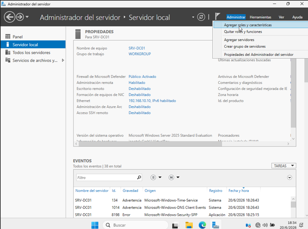
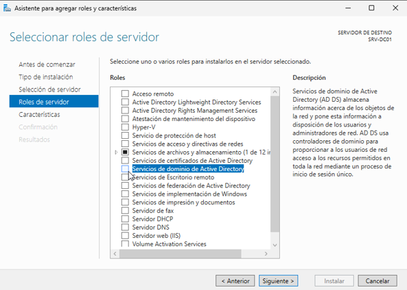
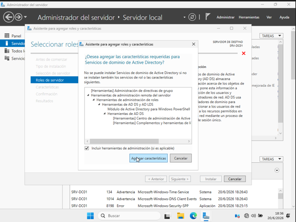
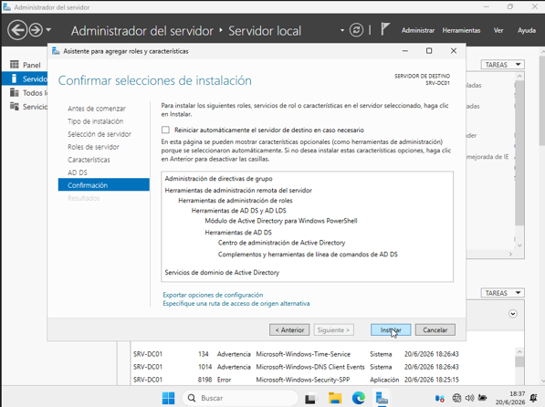
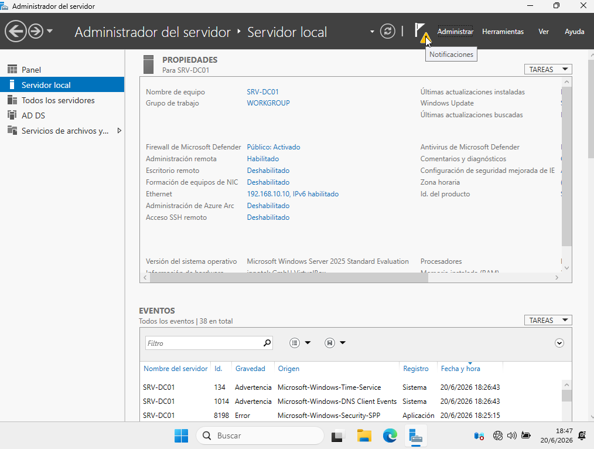
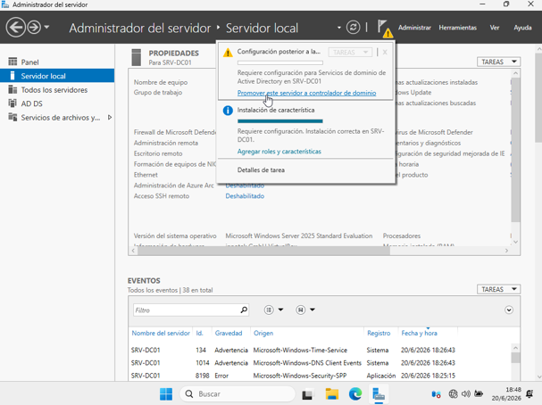
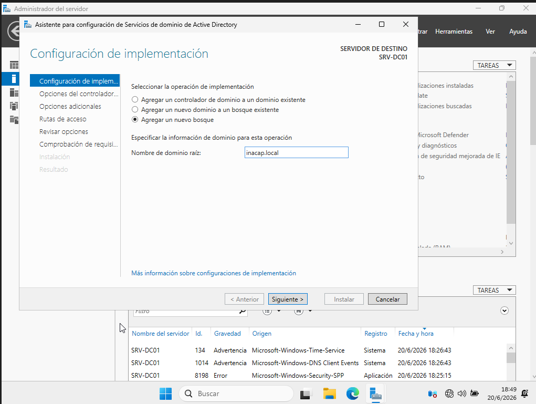
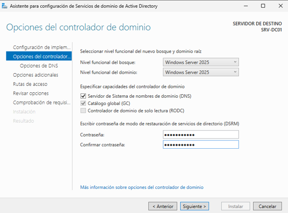
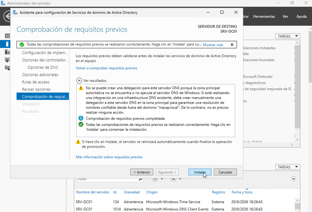

# 2.1.2 Active Directory y Dominio

**¿Qué haremos aquí de forma sencilla?**
En este momento, nuestro servidor es solo un computador común y corriente con un nombre bonito. Para que realmente se convierta en el "Jefe Supremo" de la empresa, tenemos que instalarle un programa especial llamado **Active Directory**. Este programa es como un libro de recursos humanos mágico y un portero VIP combinados en uno solo.

---

## 🧩 Guía paso a paso: Instalar Active Directory y crear el dominio `inacap.local`

### 🟦 1. Instalar el rol de Active Directory (AD DS)
1. En el **Administrador del servidor**, ve a la esquina superior derecha y haz clic en **Administrar** → **Agregar roles y características**.

2. Avanza con el botón **Siguiente** en las primeras pantallas, dejando todo configurado por defecto.
3. Al llegar a la lista de **Roles de servidor**, busca y marca la casilla **Servicios de dominio de Active Directory**.

4. Aparecerá una pequeña ventana informando que se necesitan características adicionales; haz clic en **Agregar características**.

5. Sigue presionando **Siguiente** sin cambiar nada más y finalmente haz clic en **Instalar**.

6. *Nota:* Espera pacientemente a que termine la barra de progreso. No cierres la ventana hasta que finalice.

### 🟦 2. Promover el servidor a Controlador de Dominio
1. Cuando termine la instalación, verás una **bandera amarilla** con un ícono de advertencia arriba a la derecha. Haz clic ahí.

2. Selecciona el enlace azul que dice **Promover este servidor a controlador de dominio**.

3. Se abrirá un asistente de configuración:
   * **Operación de implementación:** Elige la opción **Agregar un nuevo bosque**.
   * **Nombre de dominio raíz:** Escribe: `inacap.local`

4. En la siguiente pantalla, el sistema te pedirá una contraseña para el **Modo de restauración (DSRM)**.
   * *Tip:* Puedes usar la misma contraseña que configuraste para el Administrador para evitar olvidos.

5. Presiona **Siguiente** en todas las pantallas restantes:
   * Es totalmente normal que aparezca una advertencia sobre el servidor DNS; puedes ignorarla y seguir adelante.
   * El asistente detectará automáticamente el nombre **INACAP** como nombre NetBIOS.
   * Sigue avanzando dejando todas las carpetas (rutas de acceso) por defecto.
6. En la pantalla final, verás una verificación de requisitos con un círculo verde indicando que todo está correcto. Haz clic en **Instalar**.

### 🟦 3. Reinicio e inicio de sesión en el nuevo dominio
1. El servidor se reiniciará automáticamente.
2. **¡Paciencia!** Este reinicio tarda mucho más de lo normal, ya que el sistema está creando toda la base de datos del dominio desde cero.
3. Cuando aparezca la pantalla de inicio, presiona `Ctrl + Alt + Supr` (En VirtualBox usa el menú: **Entrada** → **Teclado** → **Insertar Ctrl-Alt-Del**).
4. Verifica que ahora, al iniciar sesión, el nombre de usuario indique explícitamente: `INACAP\Administrator`.
5. Inicia sesión con tu contraseña habitual.

---

## 🎉 Listo: tu dominio `inacap.local` está creado
Tu servidor `SRV-DC01` ahora es oficialmente un **Controlador de Dominio**. A partir de este momSento, ya puedes realizar tareas de nivel profesional:
* Unir equipos con Windows 10 al dominio.
* Crear usuarios y grupos.
* Aplicar reglas de seguridad (GPO).
* Instalar servicios de red como DHCP.
* Gestionar configuraciones de DNS para toda tu red.

---

## 🧠 ¿Por qué hacemos esto?
**Active Directory** es el corazón de cualquier red corporativa en el mundo real. Al instalarlo, estamos creando nuestro propio "ecosistema" (el dominio `inacap.local`). Él decide quién tiene permiso para usar los computadores, si las contraseñas son correctas y qué archivos se pueden ver. 

Al instalarlo, también instalamos automáticamente el servicio **DNS**, que funciona como un "traductor". Las máquinas solo entienden números complejos (como la IP `192.168.10.10`), pero nosotros entendemos nombres (como `inacap.local`). El DNS se encarga de traducir estos nombres a números para que todos los dispositivos de la empresa se entiendan perfectamente entre sí.

