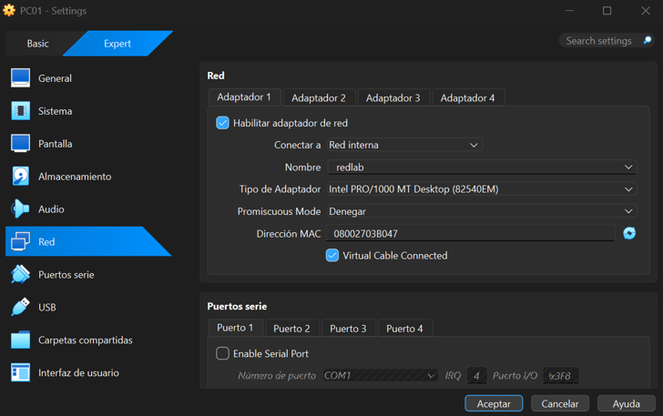
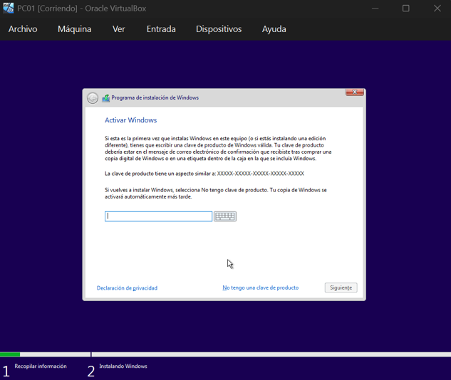
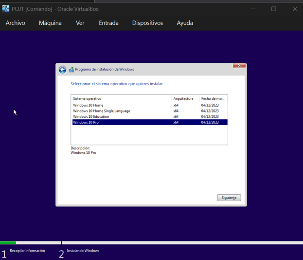
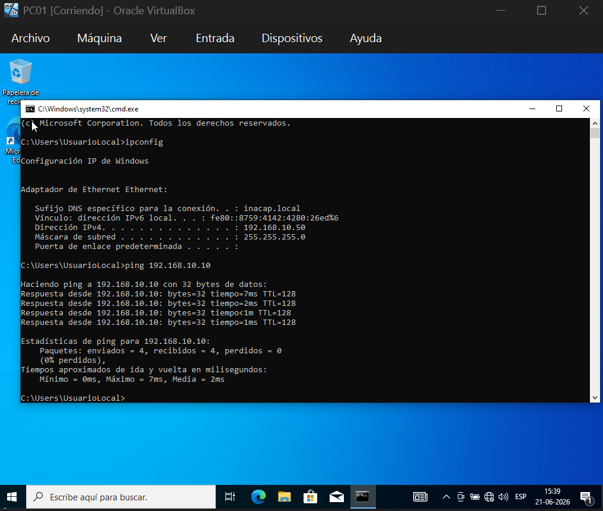
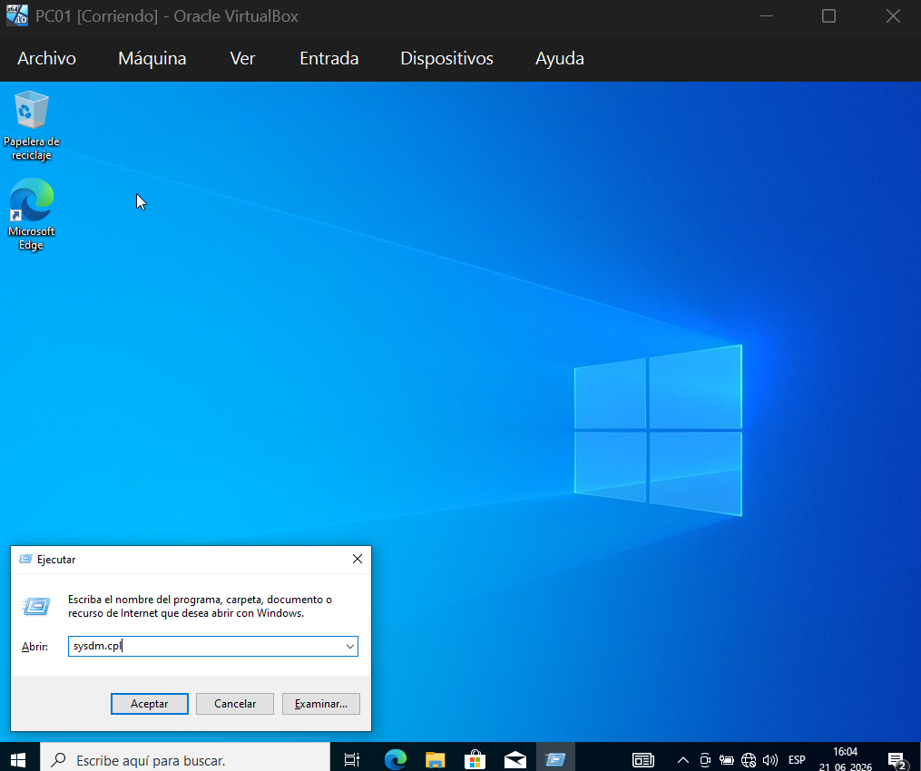
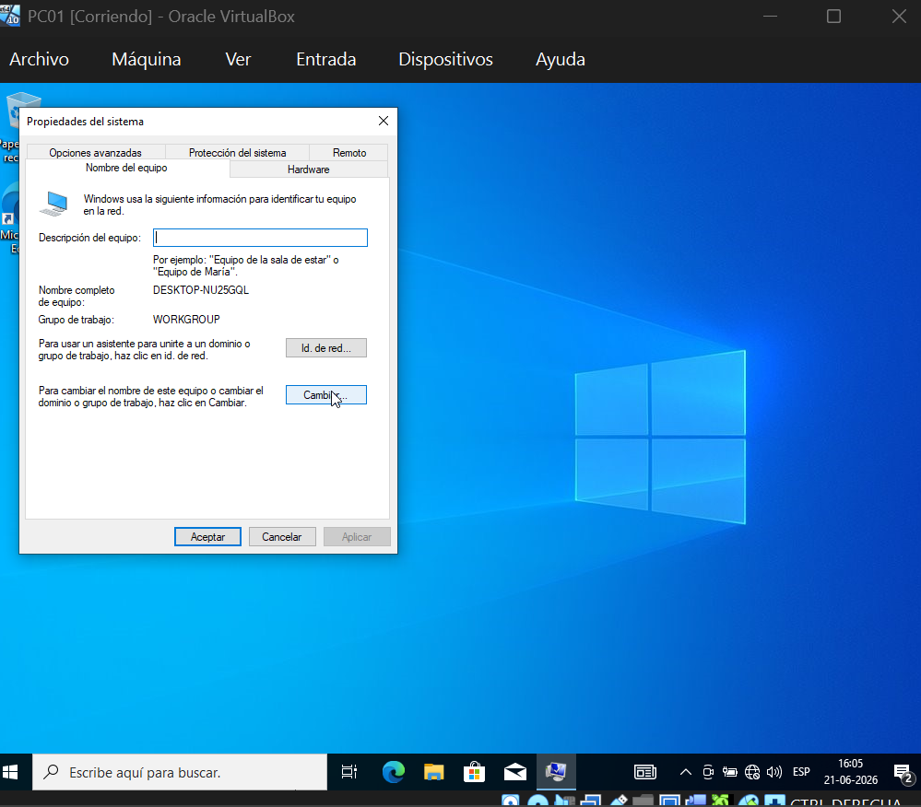
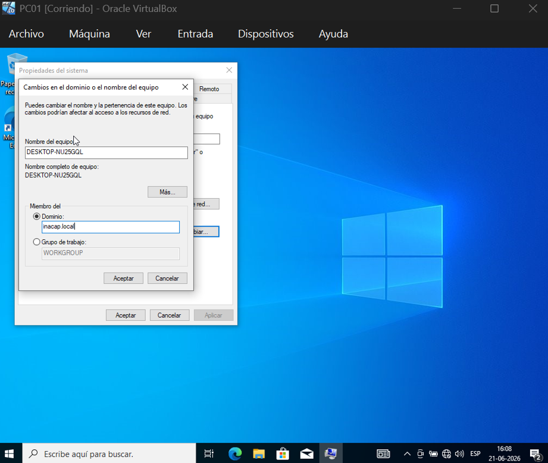
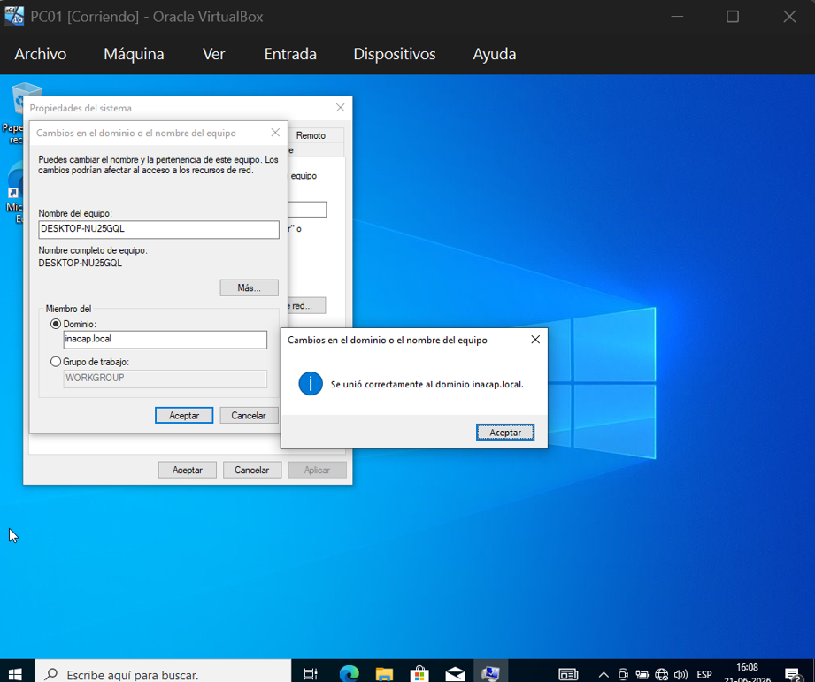
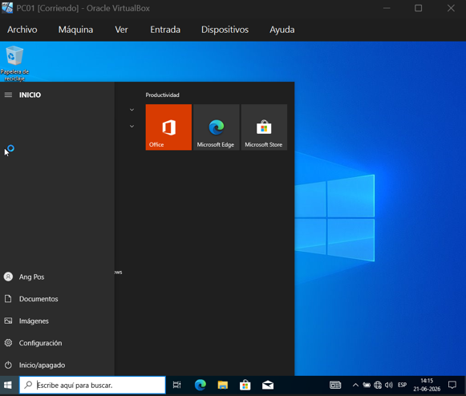

# 2.1.3 Conectar al Empleado (Windows 10)

**¿Qué haremos aquí de forma sencilla?**
Vamos a armar el computador del empleado (Windows 10). Luego, haremos el paso más emocionante: lo presentaremos formalmente a la empresa. Le diremos a este computador que deje de ser independiente y que de ahora en adelante debe obedecer al Jefe (el Servidor).

---

## 🧩 Guía paso a paso: Crear y unir el equipo PC01 al dominio

### 🟦 1. Crear la máquina virtual PC01
Primero debes preparar la máquina donde instalarás Windows 10.
1. En VirtualBox, haz clic en **Nueva**.
2. Configura los siguientes datos:
   * **Nombre:** `PC01`
   * **Tipo:** Microsoft Windows
   * **Versión:** Windows 10 (64-bit)
   * **RAM:** 2048 MB (2 GB)
   * **Disco duro:** Crea uno de 30 a 50 GB.
3. Antes de encenderla, abre el engranaje de **Configuración** → **Red**.
4. En **Adaptador 1**, selecciona la opción **Red interna** y escribe exactamente el mismo nombre que usamos en el servidor: `redlab`.

### 🟦 2. Instalar Windows 10 Pro
*Nota: Necesitas instalar obligatoriamente la versión **Pro** para poder unir el equipo al dominio. La versión Home no sirve para empresas.*
1. Monta la ISO de Windows 10 en **Almacenamiento** y enciende la máquina.
2. Cuando el instalador pida clave, selecciona la opción **"No tengo clave de producto"**.
3. Elige **Windows 10 Pro** en la lista de versiones.
4. Selecciona instalación **Personalizada** y usa el disco virtual creado.
5. Cuando la instalación te pida crear una cuenta, elige **"Cuenta sin conexión"** o **"Experiencia limitada"** (dependiendo de la versión).
6. Crea un usuario local simple (ejemplo: `UsuarioLocal`).

### 🟦 3. Verificar red y DHCP
Es importantísimo confirmar que el servidor "ve" al cliente y le está entregando una dirección IP.
1. En el escritorio de Windows 10, presiona las teclas `Win + R`, escribe `cmd` y presiona Enter.
2. En la pantalla negra, ejecuta el comando: `ipconfig`
3. La Dirección IPv4 debe ser del rango que configuraste en el servidor (ejemplo: `192.168.10.50`). 
   * *Ojo:* Si aparece una IP rara que empieza por `169.254.x.x`, significa que no ve al servidor. Revisa que ambas máquinas estén en la red interna `redlab`.
4. Haz una prueba de conexión (ping) al servidor escribiendo: `ping 192.168.10.10`. Deberías recibir respuestas exitosas.

### 🟦 4. Sincronizar la hora con el servidor (¡Paso Crítico!)
1. Revisa la hora y fecha en tu máquina con Windows 10 (esquina inferior derecha).
2. Revisa la hora y fecha en tu Windows Server.
3. **Ambas deben coincidir exactamente** (incluyendo la zona horaria).
4. Si hay alguna diferencia de minutos, haz clic derecho en el reloj de Windows 10, selecciona **Ajustar fecha y hora**, desactiva el ajuste automático y corrígela manualmente para que sea idéntica a la del servidor.

### 🟦 5. Unir PC01 al dominio inacap.local
Ahora conectarás oficialmente el equipo al dominio administrado por tu servidor.
1. Presiona `Win + R`, escribe `sysdm.cpl` y presiona Enter.
2. Ve a la pestaña **Nombre de equipo**.
3. Haz clic en el botón **Cambiar…**
4. En la sección "Miembro de", selecciona la burbuja **Dominio** y escribe: `inacap.local`.
5. Al darle Aceptar, te pedirá credenciales de administrador de la red. Ingresa:
   * **Usuario:** `INACAP\Administrator`
   * **Contraseña:** *La contraseña de tu servidor.*
6. Si todo está correcto, aparecerá el mensaje **"Bienvenido al dominio inacap.local"**.
7. Reinicia el equipo para aplicar los cambios.

### 🟦 6. Iniciar sesión con tu usuario del dominio
Después de reiniciar, el computador ya es parte de la empresa.
1. En la pantalla de inicio, selecciona **Otro usuario** (abajo a la izquierda).
2. Escribe tu usuario del dominio. Por ejemplo, si creaste un usuario en el servidor, úsalo con el formato: `INACAP\tucodigo` o `tucodigo@inacap.local`.
3. Ingresa la contraseña que le asignaste a ese usuario en el servidor.

---

## 🎉 Resumen: Cliente conectado exitosamente
¡Felicidades! Tienes una red real operando.
* ✅ Windows 10 Pro está instalado y aislado en la red interna `redlab`.
* ✅ El equipo tiene conectividad directa con el servidor (`ping`).
* ✅ La máquina pertenece al dominio `inacap.local`.
* ✅ El inicio de sesión es controlado de forma remota por Active Directory.

---

## 🧠 ¿Por qué hacemos esto?

**¿Por qué la hora es tan importante?**
Active Directory tiene un "guardia de seguridad interno" súper paranoico llamado protocolo **Kerberos**. Kerberos revisa a qué hora exacta el empleado pone su contraseña. Si tú escribes tu clave a las 15:00, pero el reloj del Servidor dice que son las 15:10, Kerberos piensa: *"¡Un hacker está intentando usar una contraseña vieja robada!"* y bloquea todo el acceso automáticamente. ¡Tienen que estar sincronizados para que confíen el uno en el otro!

**¿Por qué exigimos Windows 10 Pro?**
Las versiones "Home" (diseñadas para uso en casas) vienen con bloqueos de fábrica por parte de Microsoft. Específicamente, les quitan el botón para unirse a dominios corporativos porque asumen que un usuario doméstico no necesita funciones empresariales.