# 2.1.4 Servicios de Red (DHCP) y Usuarios

**¿Qué haremos aquí de forma sencilla?**
Primero, vamos a crear carpetas para organizar a nuestros empleados y les crearemos sus cuentas de usuario para que puedan trabajar. Luego, instalaremos un servicio llamado **DHCP**, que funciona como un dispensador de tickets en un banco, entregando números de atención (IPs) automáticamente a cada computador nuevo que encendamos.

---

## 🧩 Guía paso a paso: Configurar Usuarios y el Servidor DHCP

### 🟦 1. Crear la Unidad Organizativa, Usuarios y Grupo
En este paso vas a organizar tu dominio creando una carpeta especial (Unidad Organizativa), tus usuarios y un grupo donde estarán agrupados.

**A. Crear la Unidad Organizativa "Ventas"**
1. En el **Administrador del servidor**, ve arriba a la derecha a **Herramientas → Usuarios y equipos de Active Directory**.
2. A la izquierda verás tu dominio `inacap.local`. Haz clic derecho sobre él y selecciona **Nuevo → Unidad organizativa**.
3. Escribe el nombre: `Ventas` y presiona **Aceptar**.

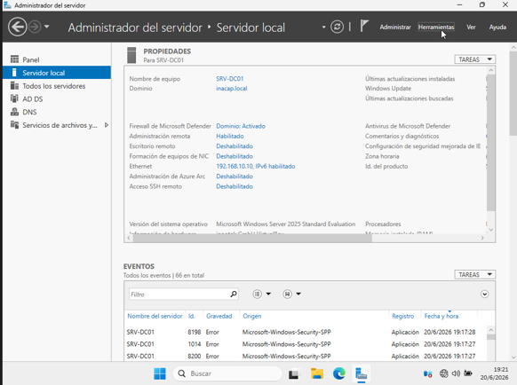

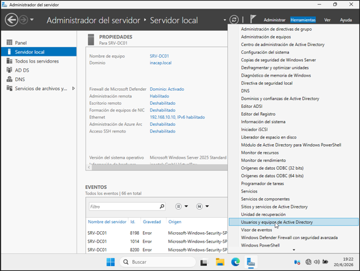

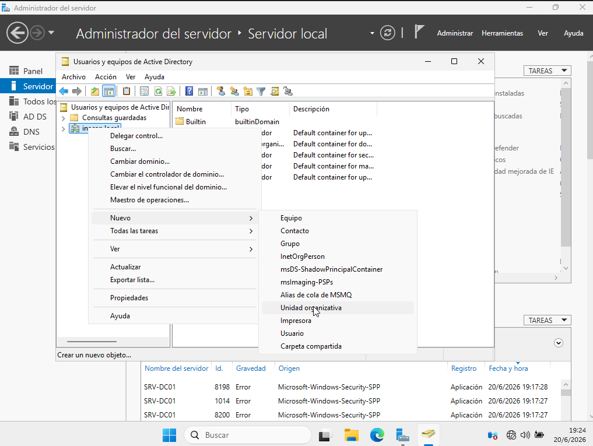

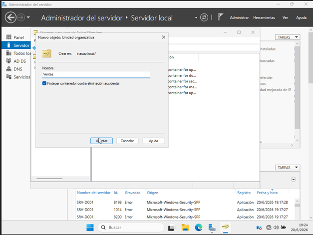

**B. Crear los usuarios**
Dentro de la carpeta Ventas vas a crear dos cuentas:
1. Haz clic derecho en la carpeta **Ventas → Nuevo → Usuario**.
2. Para el **primer usuario**:
   * En "Nombre de inicio de sesión de usuario", escribe tu código personal (3 primeras letras de tu apellido + 3 primeras de tu nombre, todo en minúsculas. Por ejemplo: `posang`).
3. En la siguiente pantalla:
   * ✓ **Desmarca** la opción *"El usuario debe cambiar la contraseña en el próximo inicio de sesión"*.
   * ✓ **Marca** la opción *"La contraseña nunca expira"*.
   * Asigna una contraseña segura (puede ser la misma del Administrador para el laboratorio).
4. Repite el proceso para crear un **segundo usuario**, poniéndole por ejemplo el nombre de inicio de sesión: `prueba1`.

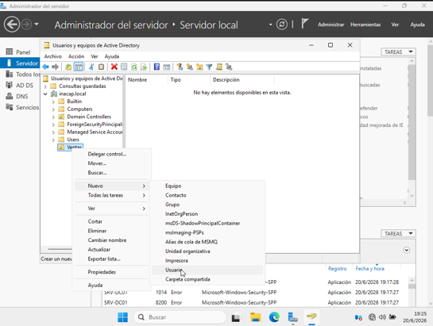

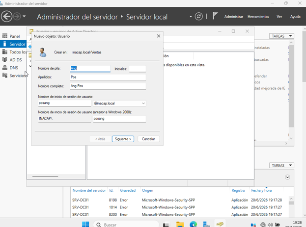

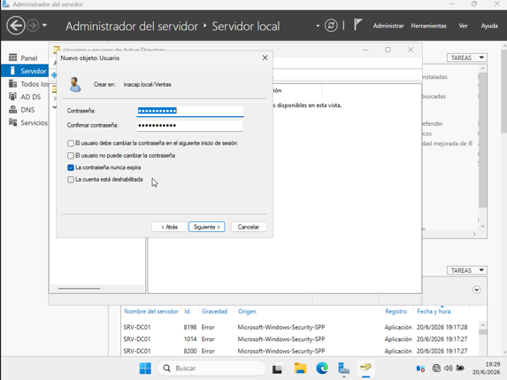

**C. Crear el grupo "G-Ventas" y agregar usuarios**
1. Haz clic derecho en la carpeta **Ventas → Nuevo → Grupo**.
2. Nombre del grupo: `G-Ventas` y presiona **Aceptar**.
3. Abre las **Propiedades** del usuario con tu código personal haciendo doble clic sobre él.
4. Ve a la pestaña **Miembro de** y haz clic en **Agregar**.
5. Escribe `G-Ventas` y haz clic en el botón **Comprobar nombres** *(el texto debe subrayarse)*. Acepta todo.
6. Repite este mismo proceso con el usuario `prueba1`.

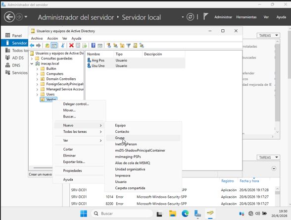

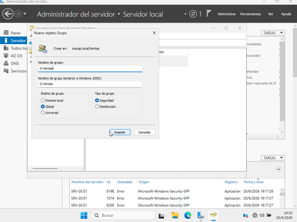

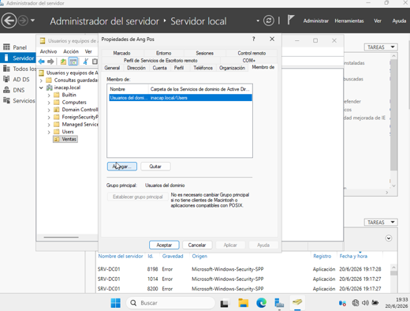

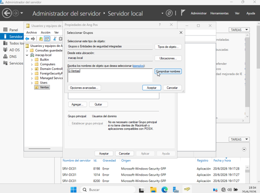

---

### 🟦 2. Instalar el servicio DHCP
Ahora vas a instalar el rol que permitirá que el servidor entregue direcciones IP automáticamente a los equipos del laboratorio.
1. En el **Administrador del servidor**, ve a **Administrar → Agregar roles y características**.
2. Avanza con **Siguiente** hasta llegar a la lista de roles de servidor.
3. Marca la casilla **Servidor DHCP** *(acepta las características adicionales en la ventana que aparece)*.
4. Continúa con **Siguiente** hasta presionar **Instalar**.
5. Cuando termine, aparecerá un aviso arriba (una bandera amarilla de notificación). Haz clic en el enlace que dice **Completar la configuración de DHCP**.
6. Se abrirá un asistente rápido: solo presiona **Confirmar** y luego **Cerrar**.

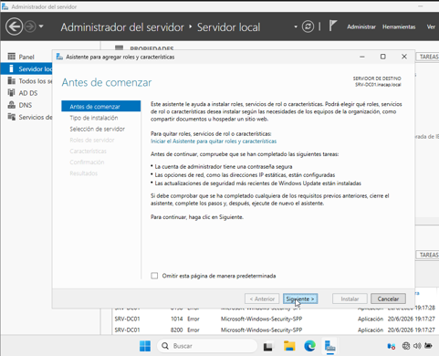

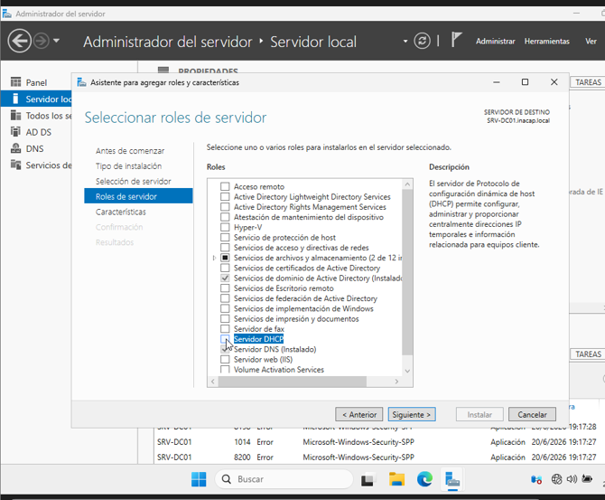

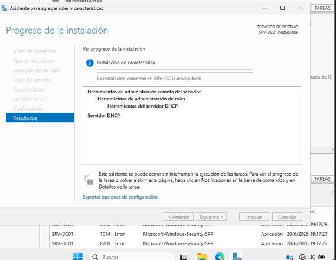

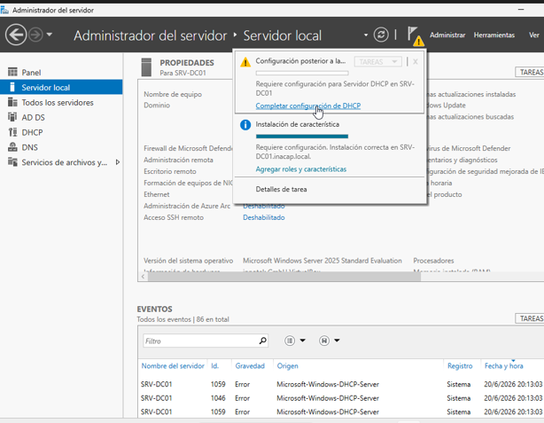

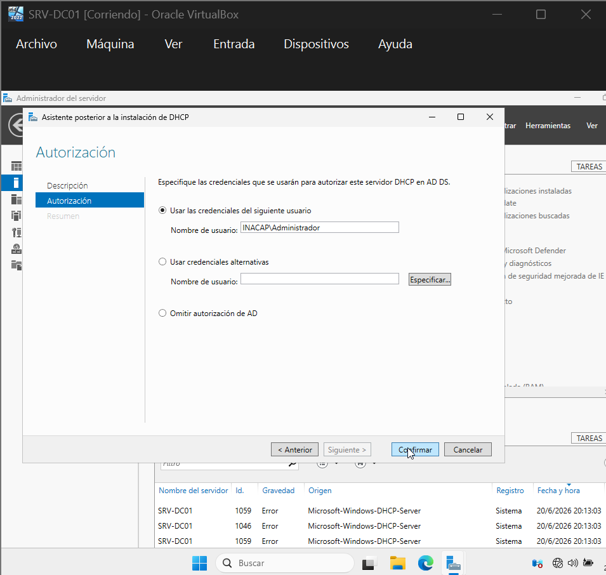

---

### 🟦 3. Crear y configurar el Ámbito DHCP
El "ámbito" es el rango de IPs que el servidor tendrá permitido entregar a los equipos del laboratorio.

**A. Crear el ámbito**
1. En el Administrador del servidor, ve a **Herramientas → DHCP**.
2. Expande el árbol de tu servidor (`SRV-DC01`).
3. Haz clic derecho sobre **IPv4** y selecciona **Ámbito nuevo**.
4. Ponle un nombre para identificarlo, por ejemplo: `RedLab` y dale a Siguiente.

**B. Configurar el rango de IP**
1. **Dirección IP inicial:** `192.168.10.50`
2. **Dirección IP final:** `192.168.10.100`
3. **Longitud:** `24` *(la máscara de subred se pondrá sola en `255.255.255.0`)*.
4. Dale a Siguiente en "Exclusiones" *(déjalo vacío)* y Siguiente en "Duración de la concesión" *(déjalo por defecto)*.

**C. Opciones del DHCP**
1. Marca la opción **Configurar estas opciones ahora**.
2. **Puerta de enlace:** Déjala vacía y presiona Siguiente.
3. **DNS y Dominio:**
   * Dominio primario: `inacap.local`
   * Servidor DNS: `192.168.10.10` *(Si no aparece en la lista de abajo, escríbelo arriba y presiona el botón Agregar)*.
4. **Servidores WINS:** Déjalo vacío y presiona Siguiente.

**D. Activar el ámbito**
1. Selecciona **Activar este ámbito ahora**.
2. Haz clic en **Finalizar**.

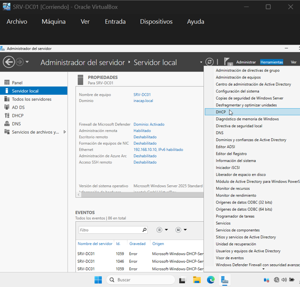

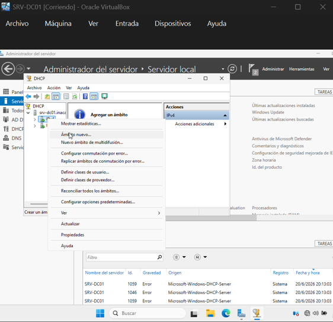

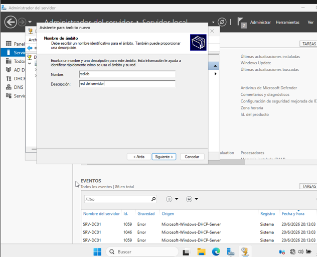

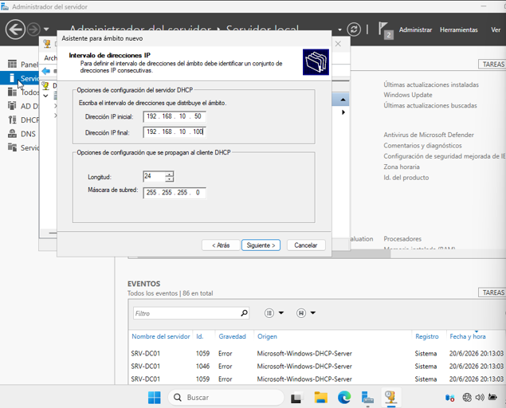

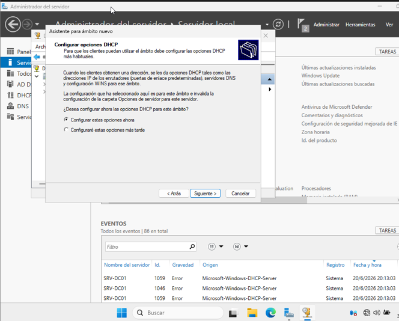

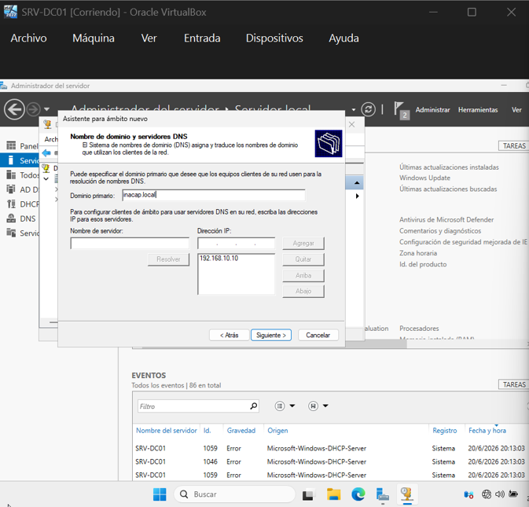

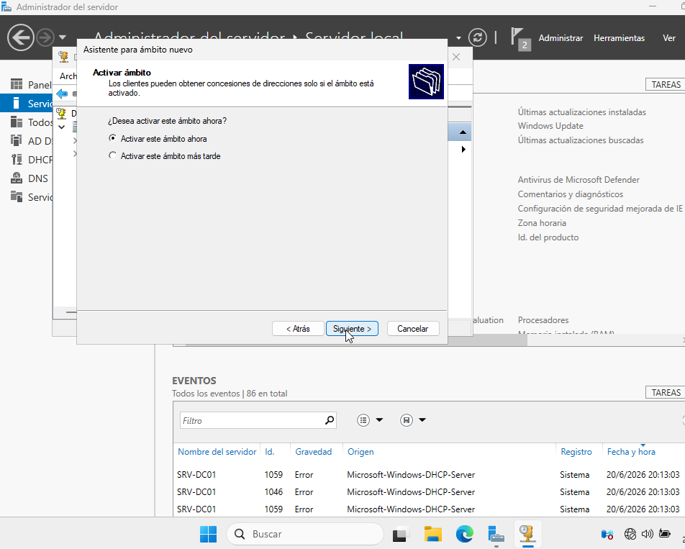

---

## 🎉 Resumen: Red automatizada
Con esto finalizado, tu infraestructura ha subido de nivel.
* ✅ Tienes una estructura organizativa real con cuentas de usuarios y grupos.
* ✅ El servidor DHCP está activo y autorizando conexiones.
* ✅ Tienes un banco de 50 direcciones IP listas para ser entregadas de forma automática.

---

## 🧠 ¿Por qué hacemos esto?

Imagínate llegar a una empresa con 500 computadores y tener que ir uno por uno escribiendo a mano su dirección IP, su máscara y su DNS. ¡Sería una tortura y tomaría semanas! 

El **DHCP** (Protocolo de Configuración Dinámica de Host) es nuestro salvador administrativo. Cuando un computador se enciende y se conecta al cable de red, grita invisiblemente: *"¡Hola, soy nuevo, necesito un número para existir en esta red!"*. 

El Servidor DHCP lo escucha inmediatamente, revisa su "Ámbito" (el rango que configuramos del 50 al 100) y le responde: *"Toma, tú serás la IP 192.168.10.50. Por cierto, el directorio telefónico de la empresa (DNS) es el 192.168.10.10"*. Todo se configura en milisegundos sin que tú muevas un solo dedo.