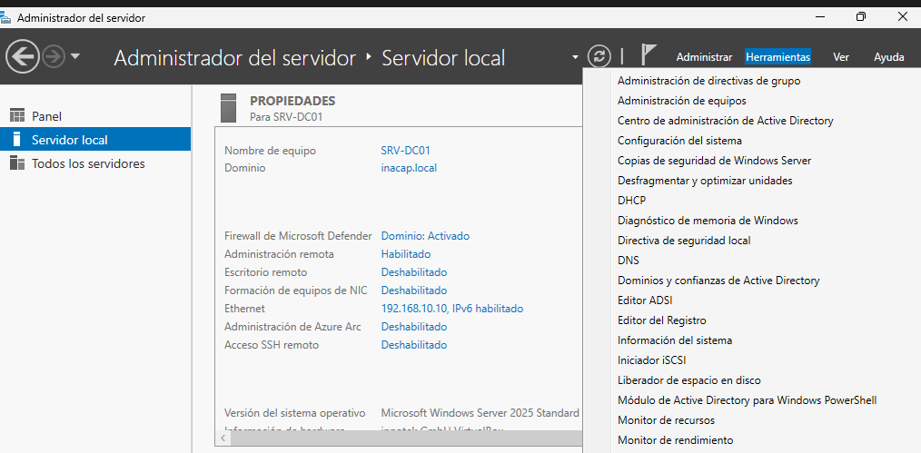
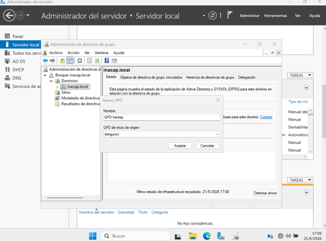
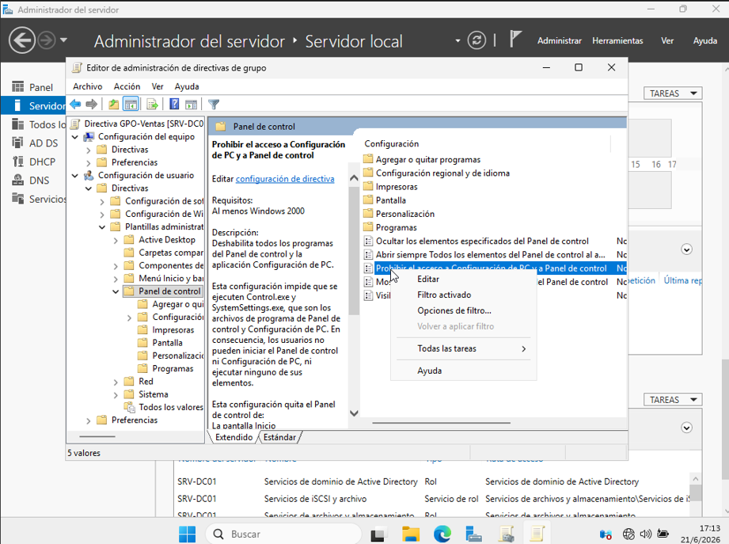
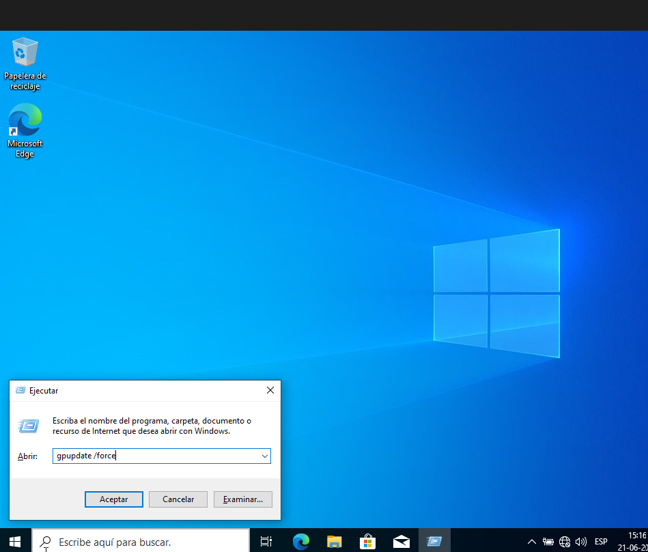
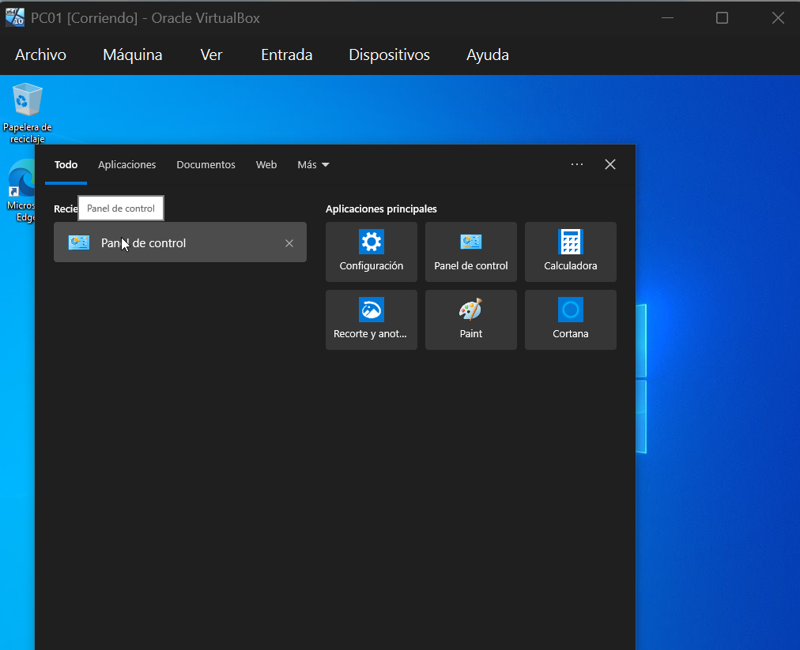

# 2.1.5 Políticas de Grupo (GPO)

**¿Qué haremos aquí de forma sencilla?**
A los jefes de informática no les gusta que los empleados anden desconfigurando los computadores. Para evitar ir puesto por puesto prohibiendo cosas, usaremos la "magia" del servidor. Crearemos una regla en el Servidor que viajará por los cables y le bloqueará el acceso al 'Panel de Control' a todos los empleados del departamento de Ventas.

**El Paso a Paso:**
## Configuración en el servidor (SRV-DC01)

1. Abre el **Administrador del servidor**, selecciona **Herramientas** y luego **Administración de directivas de grupo**.

2. En el panel izquierdo, despliega la siguiente ruta:

   **Bosque: inacap.local → Dominios → inacap.local**

3. Busca la Unidad Organizativa **Ventas** que creaste anteriormente. Haz clic derecho sobre ella y selecciona **Crear un GPO en este dominio y vincularlo aquí...**

4. Asigna el nombre **GPO-Ventas** y haz clic en **Aceptar**.

5. Haz clic derecho sobre la nueva directiva **GPO-Ventas** y selecciona **Editar**.

6. En la ventana del Editor de administración de directivas de grupo, navega hasta la siguiente ubicación:

   **Configuración de usuario → Directivas → Plantillas administrativas → Panel de control**

7. En el panel derecho, busca la opción **Prohibir el acceso al Panel de control y a la configuración de PC** y haz doble clic sobre ella.

8. Selecciona la opción **Habilitada**, luego haz clic en **Aplicar** y finalmente en **Aceptar**. Una vez guardados los cambios, puedes cerrar el editor.







## Aplicar la política en el equipo cliente (PC01)

1. Inicia sesión en el equipo cliente con un usuario perteneciente al dominio (por ejemplo, el usuario creado en la Unidad Organizativa **Ventas**).

2. Abre el símbolo del sistema (**CMD**) presionando **Win + R**, escribe `cmd` y presiona **Enter**.

3. Ejecuta el siguiente comando para actualizar las políticas del dominio:

   ```
   gpupdate /force
   ```

4. Espera a que el proceso finalice correctamente. Luego, cierra la sesión del usuario e inicia sesión nuevamente para que los cambios se apliquen por completo.

5. Finalmente, intenta abrir el **Panel de control** o la **Configuración de Windows**. Si la política se aplicó correctamente, aparecerá un mensaje indicando que el acceso ha sido restringido por el administrador del sistema.






**¿Por qué hacemos esto?**
GPO significa "Objeto de Directiva de Grupo". Es como un sistema de altoparlantes en nuestra oficina virtual. En lugar de ir máquina por máquina, el Administrador usa el altoparlante y dice: *"Nadie en Ventas puede usar el Panel de Control"*. Y de forma instantánea, todas las computadoras acatan la orden. Al aplicar esta regla específicamente en la carpeta de 'Ventas', nos aseguramos de no bloquearle el computador, por ejemplo, a los gerentes.
