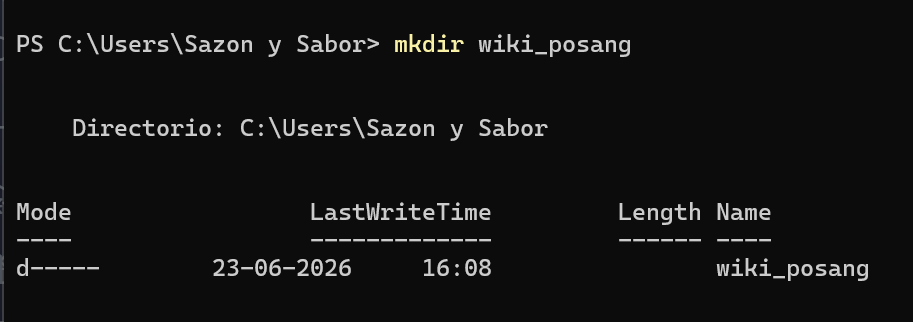
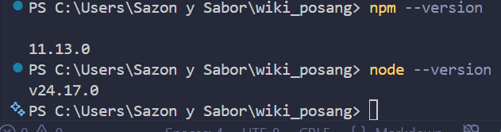
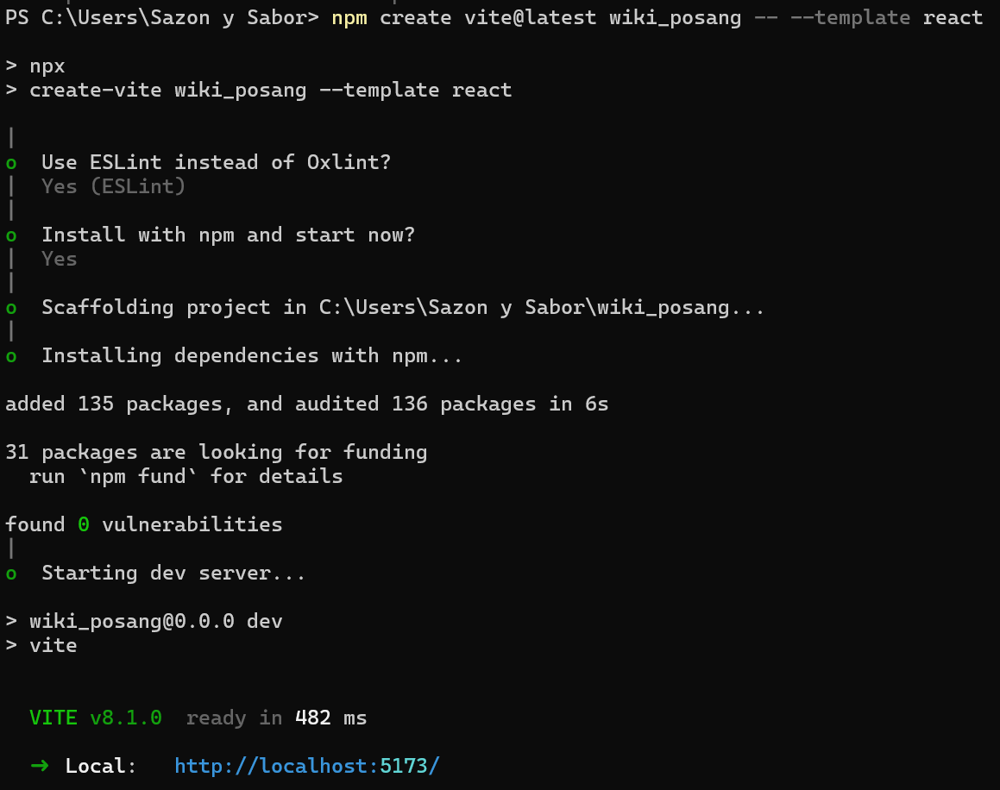
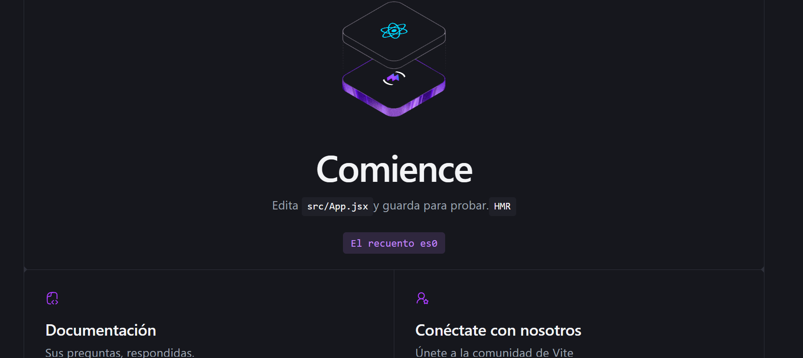

#Proceso de Creación de la AppWiki

Este apartado se ha realizado para mostrar el proceso de la creación de la wiki.

1. Como Primer punto, se ejecutó la creación del archivo wiki_posang, que será la carpeta que contendrá todo lo relacionado con la app.

2. Antes de continuar con la creación del proyecto, nos aseguramos de tener descargados y actualizados Node.js, que es el motor de ejecución, tambien Git que es el sistema de control de versiones, así como también, una cuenta creada en github. También se estará trabajando con el editor de código VS Code, y Vercel, que es la Plataforma de despliegue continuo para aplicaciones Web.

3. Ahora, para iniciar nuestra apliación web responsiva, se utilizó el comando `npm create vite@latest wiki-server-cliente -- --template react` para crear la estructura base de React con Vite.

   Elegimos opción ESLint, porque Es el estándar en React.Ayuda a detectar errores y malas prácticas automáticamente. Mejora la calidad del código.

   luego  entramos a la carpeta destinada para el proyecto y así comenzar las descargas de las dependencias necesarias para el lienzo en blanco donde plasmaremos el proyecto.

4. Luego 

